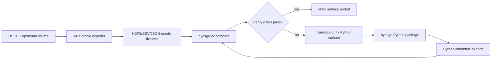
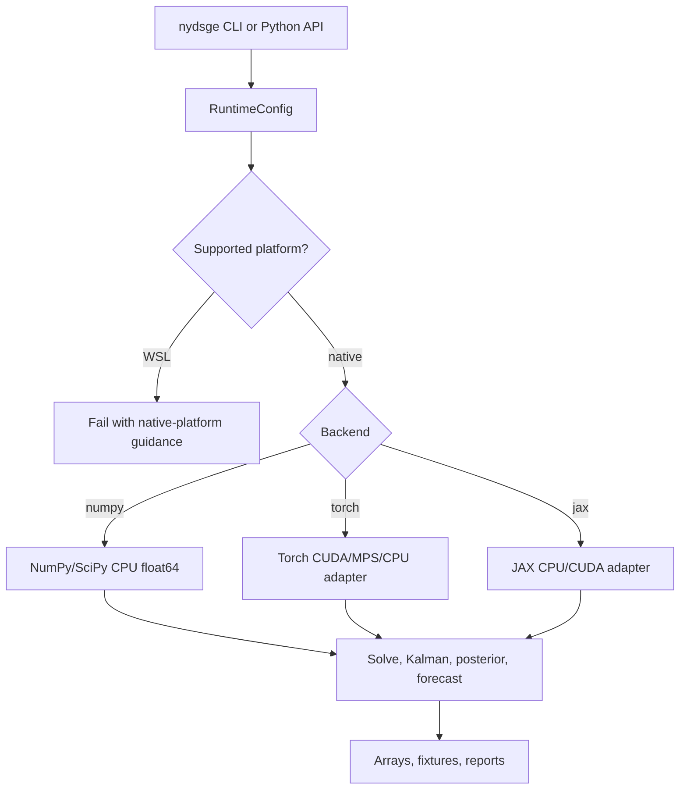
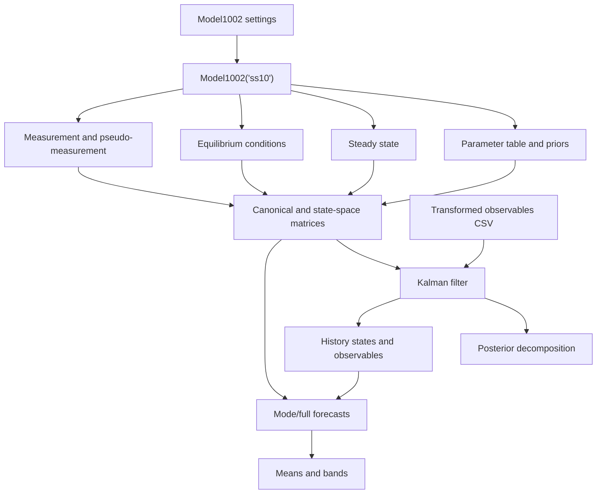
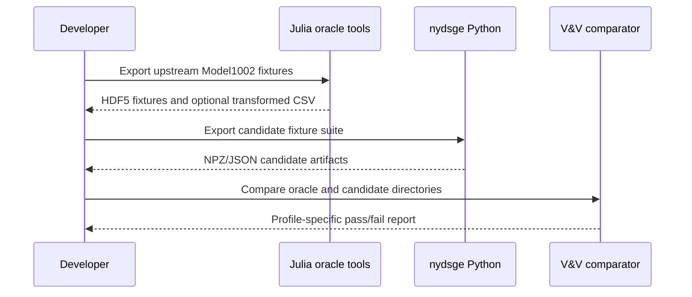

# nydsge

`nydsge` is a native Python port of the New York Fed DSGE model workflow.

## Leading Instruction

Port the upstream Julia implementation into native, tested Python. Treat
`FRBNY-DSGE/DSGE.jl` as the behavioral source of truth, translate its model
equations, data contracts, estimation, forecast, and validation surfaces into
Python, and prove each translated surface with deterministic parity fixtures.

Do not turn the runtime package into a Julia wrapper. Julia is allowed only in
`tools/oracle_julia/` to generate oracle fixtures and comparison evidence.

## Port Target

The first hard target is strict CPU float64 parity for upstream
`Model1002("ss10")` with:

- `data_vintage=181115`
- `date_forecast_start=2018-Q4`
- modal and full `histobs`
- modal and full `forecastobs`
- current-parameter posterior and Kalman decomposition
- deterministic forecast and means/bands artifacts

After CPU parity is stable, the package expands toward native acceleration on
macOS MPS, Windows CUDA, and Linux CUDA.

## Design Principles

- Translate Julia behavior first; optimize only after parity gates are stable.
- Keep NumPy/SciPy float64 CPU output as the release-blocking oracle path.
- Use Torch and JAX as optional array runtimes behind an explicit backend layer.
- Keep Julia out of `src/nydsge`; fixture generation belongs under
  `tools/oracle_julia/`.
- Prefer deterministic fixture comparisons over visual inspection or ad hoc
  numerical checks.
- Preserve upstream naming, dimensions, labels, and data orientation where doing
  so makes parity easier to audit.

## Architecture



The runtime package is pure Python. The Julia side exists to produce stable
fixtures for V&V, not to serve model results at runtime.

## Runtime Control Flow



`backend="numpy"` is the reference path. `backend="torch"` supports Windows
CUDA and macOS MPS where available. `backend="jax"` is reserved for Linux CUDA
experiments because official JAX CUDA wheels do not support Windows CUDA.

## Model1002 Parity Flow



The hard target combines setup, matrices, Kalman, posterior, mode forecast,
mode history, full forecast samples, and full history arrays. Each surface has
a direct candidate export and a Julia oracle comparison profile.

## Repository Layout

```text
src/nydsge/
  backends.py                 Runtime array adapters.
  bench.py                    Benchmark CLI helpers.
  cli.py                      Typer command surface.
  core.py                     Model, setting, parameter, and transform types.
  data.py                     Data loading, transforms, and source builders.
  estimate.py                 Posterior, optimization, and MH sampling.
  forecast.py                 Mode/full forecast and means/bands logic.
  kalman.py                   Filtering and likelihood kernels.
  parameters.py               Parameter transforms and prior helpers.
  purity.py                   Runtime audit that blocks Julia wrappers.
  runtime.py                  Platform, backend, device, and dtype selection.
  solve.py                    Gensys and state-space solve helpers.
  vv.py                       Fixture export, coverage, and comparison tools.
  models/
    registry.py               Discoverable model constructor registry.
    m1002*.py                 Model1002 translation surfaces.

tools/oracle_julia/
  benchmark_model1002.jl      Migration-only Julia benchmark baseline writer.
  export_model1002.jl         Migration-only Julia fixture exporter.
  setup_env.jl                Julia oracle environment bootstrap.

docs/
  port_matrix.csv             Porting status by upstream source area.

tests/
  test_*.py                   Python unit, CLI, and parity tests.
  fixtures/                   Ignored generated candidate/oracle fixture data.
```

## Platform Contract

- macOS: CPU and PyTorch MPS.
- Windows: CPU and PyTorch CUDA.
- Linux: CPU, PyTorch CUDA, and JAX CUDA experiments.
- WSL is intentionally unsupported; `nydsge doctor` exits nonzero when it
  detects WSL and directs users to native Windows, macOS, or Linux.
- CPU parity uses NumPy/SciPy float64 and remains the release-blocking oracle.
- PyTorch MPS is an accelerator path for float32; float64 uses CPU parity paths.

### Acceleration install

Core package install:

```powershell
uv sync
```

Optional accelerator dependencies:

```powershell
# PyTorch (CPU-only by default; use PyTorch selectors for CUDA/MPS).
uv sync --extra torch

# JAX (CPU + Linux CUDA in compatible environments).
uv sync --extra jax
```

For Windows CUDA, install a PyTorch CUDA wheel matching your toolkit before using
`--extra torch` (or let your preferred CUDA-enabled PyTorch distribution resolve
it).

## Development Setup

```powershell
uv sync
uv run ruff format --check .
uv run ruff check .
uv run ty check .
uv run pytest
```

Useful smoke checks:

```powershell
uv run nydsge doctor
uv run nydsge models --json
uv run nydsge solve
uv run nydsge bench --kernel all --horizon 40 --periods 40 --batches 8 --draws 2 --repeats 3
uv run nydsge bench --kernel all --horizon 40 --periods 40 --batches 8 --draws 2 --repeats 3 --output reports\benchmarks\local.json
uv run nydsge bench --kernel all --baseline path\to\julia_benchmark.json --json
uv run nydsge vv runtime-purity --json
uv run nydsge vv backend-parity --kernel all --horizon 40 --periods 40
```

`nydsge bench` includes forecast, single Kalman, batched Kalman, and hard-target
replay kernels. The batched kernel reports a three-dimensional state shape and
the independent batch count for each native backend target; the hard-target
kernel replays the Python matrix, posterior, mode forecast/history, full
zero-shock forecast/history, and means/bands path.
Use `--baseline` with externally generated oracle/Julia benchmark JSON to attach
baseline elapsed times and speedup ratios without making Python call Julia.
Use `--output` to persist a versioned benchmark reference report with command
parameters, platform metadata, runtime availability rows, and result rows for
cross-machine timing curation.
Generate a Julia forecast baseline with:

```powershell
julia +1.8 --project=tools/oracle_julia tools/oracle_julia/benchmark_model1002.jl --out tests/fixtures/oracle/julia_benchmark_model1002.json --kernel forecast --horizon 40 --repeats 3
uv run nydsge bench --kernel forecast --horizon 40 --repeats 3 --baseline tests/fixtures/oracle/julia_benchmark_model1002.json --json
```

You can capture a full local + optional baseline bundle in one command for
cross-machine curation:

```powershell
uv run python scripts/capture_benchmarks.py --kernel all --output-dir reports\benchmarks --capture-julia-baseline --label windows-cuda --julia-version 1.8
```

For a cross-machine capture workflow with explicit labels and baseline attachment,
see [`docs/benchmark_references.md`](docs/benchmark_references.md).

To compare reports across captures:

```powershell
uv run python scripts/compare_benchmark_reports.py `
  --report reports\benchmarks\windows-cuda_all_2026-06-22_local.json `
  --report reports\benchmarks\linux-cuda_all_2026-06-22_local.json `
  --baseline-machine windows-cuda --baseline-backend numpy
```

## Common CLI Flows

### Data

```powershell
uv run nydsge data build --input path\to\raw_levels.csv --output path\to\observables.csv
uv run nydsge data build --input path\to\raw_levels.csv --output path\to\observables.csv --population-forecast path\to\population_forecast.csv
uv run nydsge data build --input path\to\raw_levels.csv --output path\to\observables.csv --no-hpfilter-population
uv run nydsge data sources --source-root path\to\raw --vintage 181115 --json
uv run nydsge data prepare-sources --source-root path\to\raw --vintage 181115 --start-date 1959-Q3 --end-date 2018-Q3 --json
uv run nydsge data fetch-fred --output path\to\raw\fred_current.csv --start-date 1959-Q3 --end-date 2018-Q3
uv run nydsge data fetch-fred-api --output path\to\raw\fred_181115.csv --realtime-start 181115 --realtime-end 181115 --start-date 1959-Q3 --end-date 2018-Q3
uv run nydsge data build-sources --source-root path\to\raw --output path\to\observables.csv --start-date 1959-Q3 --end-date 2018-Q3
```

`data sources` lists the source namespaces, required mnemonics, optional
mnemonics, candidate local file paths, and whether a source file is currently
available under `--source-root`.
`data prepare-sources` creates the source root if needed, fetches the canonical
FRED vintage file, and reports the remaining local source files required before
`data build-sources` can run. When `--realtime-start` or `--realtime-end` is
omitted, `prepare-sources` uses `--vintage` as the point-in-time realtime window.
`data fetch-fred-api` resolves the FRED API key from `--api-key`, then the
`FRED_API_KEY` environment variable, then a local `.env` file.
For Model1002 vintage requests, FRED series known to be optional and unavailable
in ALFRED are written as all-missing source columns so the rest of the source
bundle can still be built and compared. FRED JSON error payloads are surfaced as
data-fetch failures for required series. Required source series must have at
least one numeric observation in every requested quarter; all-missing required
quarters fail during source preparation. When a real-time range returns multiple
revisions for the same observation date, `data fetch-fred-api` keeps the latest
realtime row before quarterly aggregation and rejects duplicate dates that lack
realtime metadata. `data fetch-fred-api --vintage-dates ...` uses FRED's
vintage-date mode instead of realtime bounds and defaults that request to output
type 2.

### Estimation

```powershell
uv run nydsge estimate --data path\to\observables.csv
uv run nydsge estimate --data path\to\observables.csv --backend numpy --device cpu
uv run nydsge estimate --data path\to\observables.csv --optimize --parameters alpha,rho --maxiter 25 --hessian --mode-output outputs\mode.npz
uv run nydsge estimate --data path\to\observables.csv --mode-input outputs\mode.npz --mh-draws 1000 --mh-burnin 100 --sampler-output outputs\sampler.npz
uv run nydsge estimate --data path\to\observables.csv --parameters alpha,rho --mh-draws 1000 --mh-burnin 100 --proposal-scale 0.1 --seed 123
uv run nydsge vv sampler-diagnostics --sampler outputs\sampler.npz --windows 4 --json
```

`vv sampler-diagnostics` reports retained draws, acceptance windows, proposal
covariance eigen/condition checks, log-posterior range, and per-parameter
effective sample size for sampler parity work.

### Forecasts

```powershell
uv run nydsge forecast --horizon 40
uv run nydsge forecast --input-type full --draws 1000 --seed 123 --horizon 40
uv run nydsge forecast --input-type full --shock-samples outputs\shock_samples.npz --horizon 40
uv run nydsge forecast --input-type full --sampler-draws outputs\sampler.npz --data path\to\observables.csv --include-history --horizon 40
uv run nydsge forecast --cond-type semi --data path\to\observables_with_condition.csv --include-history --horizon 40
uv run nydsge forecast --data path\to\observables.csv --include-history --history-method smoothed --horizon 40
uv run nydsge forecast --horizon 8 --zlb-rates "0.25,0.25,0.50,1.00" --json
```

### Means And Bands

```powershell
uv run nydsge meansbands --horizon 40
uv run nydsge meansbands --input-type full --draws 1000 --seed 123 --horizon 40
uv run nydsge meansbands --input-type full --sampler-draws outputs\sampler.npz --source histobs --data path\to\observables.csv
uv run nydsge meansbands --cond-type full --source forecastobs --data path\to\observables_with_condition.csv
uv run nydsge meansbands --source forecastpseudo --horizon 40
```

### Forecast Analysis Reports

`nydsge report` productizes forecast analysis artifacts: an all-observable macro
forecast panel, per-observable impulse responses, and a true historical shock
decomposition. Each command writes labeled numeric arrays (`.npz`), a JSON
summary, and—unless `--no-plots` is passed—deterministic PNG figures. Plotting
requires the optional `plot` extra (`uv pip install nydsge[plot]` or
`pip install matplotlib`); the numeric arrays export without matplotlib.

```powershell
# Full bundle: macro forecast panel + per-observable IRFs + historical decomposition.
uv run nydsge report forecast --data path\to\observables.csv --forecast-start 2018-Q4 --horizon 40 --output-dir outputs\forecast_report

# Impulse responses only (computed from the solved state-space system).
uv run nydsge report irf --horizon 40 --normalization one_sd --output-dir outputs\irf

# True historical shock decomposition (RTS-smoothed shock/state contributions).
uv run nydsge report historical-decomposition --data path\to\observables.csv --output-dir outputs\historical_decomposition

# Numeric arrays only, no figures (no matplotlib needed).
uv run nydsge report irf --horizon 40 --no-plots --json
```

Notes:

- IRF shock normalization is documented in the output summary: `unit` applies a
  `1.0` impulse, `one_sd` a one-standard-deviation impulse (`sqrt(diag(QQ))`).
- The historical decomposition is a genuine decomposition: per-shock
  contributions plus an initial-condition/deterministic baseline reconcile to
  the model-implied smoothed observable path (the command fails if reconciliation
  exceeds tolerance). It is not an IRF accumulation.
- Reports exit nonzero when array dimensions and axis labels are inconsistent.

## V&V Workflow



Generate the Python candidate bundle:

```powershell
uv run nydsge vv export-suite --output-dir tests/fixtures/candidate --data path\to\observables.csv --full-draws 1000 --seed 123 --horizon 40 --json
uv run nydsge vv export-suite --output-dir tests/fixtures/candidate --shock-samples path\to\shock_samples.npz --horizon 40 --json
uv run nydsge vv raw-data-smoke --source-root path\to\raw --output-dir tests\fixtures\raw_data_smoke --start-date 1959-Q3 --end-date 2018-Q3 --horizon 40 --json
uv run nydsge vv oracle-coverage --oracle-dir tests/fixtures/oracle --profile hard-target --json
uv run nydsge vv compare --oracle-dir tests/fixtures/oracle --candidate-dir tests/fixtures/candidate --profile hard-target --tolerance-profile strict --json
```

`vv raw-data-smoke` accepts the same population preprocessing controls as the
source data builder, including `--population-forecast`,
`--no-hpfilter-population`, and `--population-hpfilter-lambda`.

Focused profiles are available when debugging one surface at a time:

```powershell
uv run nydsge vv compare --profile model-setup
uv run nydsge vv compare --profile model-metadata
uv run nydsge vv compare --profile matrix
uv run nydsge vv compare --profile financial-frictions
uv run nydsge vv compare --profile kalman
uv run nydsge vv compare --profile posterior
uv run nydsge vv compare --profile forecast-mode
uv run nydsge vv compare --profile forecast-mode-history
uv run nydsge vv compare --profile forecast-full
uv run nydsge vv compare --profile forecast-full-history
uv run nydsge vv compare --profile hard-target --tolerance-profile strict --json
```

Named tolerance profiles keep comparisons explicit:

- `strict`: `atol=rtol=1e-10` for CPU oracle and matrix parity.
- `cpu-oracle`: `atol=rtol=1e-10` for release-blocking CPU parity.
- `forecast`: `atol=rtol=1e-8` for forecast and means/bands accumulation.
- `accelerator`: `atol=rtol=1e-5` for CUDA, MPS, JAX, and Torch comparisons
  against the NumPy CPU reference.

## Julia Oracle Tools

The Julia tooling lives under `tools/oracle_julia/` and is migration-only:

```powershell
juliaup add 1.8
julia +1.8 tools/oracle_julia/setup_env.jl
julia +1.8 --project=tools/oracle_julia tools/oracle_julia/export_model1002.jl --out tests/fixtures/oracle/m1002_ss10.h5
julia +1.8 --project=tools/oracle_julia tools/oracle_julia/benchmark_model1002.jl --out tests/fixtures/oracle/julia_benchmark_model1002.json --kernel forecast --horizon 40 --repeats 3
```

Example hard-target replay:

```powershell
julia +1.8 --project=tools/oracle_julia tools/oracle_julia/export_model1002.jl --out tests/fixtures/oracle/m1002_ss10_real_history.h5 --include-history true --include-kalman true --include-posterior true --include-forecast true --include-full-forecast true --full-draws 2 --data-out tests/fixtures/oracle/observables.csv --horizon 2
uv run nydsge vv export-suite --output-dir tests/fixtures/candidate --data tests/fixtures/oracle/observables.csv --shock-samples tests/fixtures/oracle/m1002_ss10_real_history.h5 --allow-empty-data-columns --horizon 2 --json
uv run nydsge vv compare --oracle-dir tests/fixtures/oracle --candidate-dir tests/fixtures/candidate --profile hard-target --tolerance-profile strict --json
```

Some 181115 optional series are all missing in ALFRED. Use
`--allow-empty-data-columns` only for this Julia replay case.

## Python API

```python
from nydsge.data import df_to_matrix, load_data
from nydsge.estimate import estimate
from nydsge.forecast import compute_meansbands, forecast_one
from nydsge.models import Model1002
from nydsge.runtime import RuntimeConfig

runtime = RuntimeConfig(backend="auto", device="auto", dtype="float64")
m = Model1002(
    subspec="ss10",
    runtime=runtime,
    settings={
        "data_vintage": "181115",
        "date_forecast_start": "2018-Q4",
    },
)

df = load_data(m)
data = df_to_matrix(m, df)
estimate(m, data)
forecast_one(
    m,
    input_type="mode",
    cond_type="none",
    output_vars=["histobs", "forecastobs"],
)
compute_meansbands(
    m,
    input_type="mode",
    cond_type="none",
    output_vars=["histobs", "forecastobs"],
)
```

## Porting Status

`docs/port_matrix.csv` is the working checklist for upstream source areas. It
tracks each translated surface, the Python target file, and remaining parity
notes.

Most economic kernels are still being translated. Commands that depend on an
unported kernel raise `NotPortedError` with the upstream Julia source area that
still needs translation.

## References

- [DSGE.jl](https://github.com/FRBNY-DSGE/DSGE.jl)
- [DSGE.jl docs](https://frbny-dsge.github.io/DSGE.jl/latest/)
- [PyTorch local install](https://pytorch.org/get-started/locally/)
- [PyTorch MPS docs](https://docs.pytorch.org/docs/stable/notes/mps.html)
- [JAX install docs](https://docs.jax.dev/en/latest/installation.html)
- [JAX Windows CUDA note](https://docs.jax.dev/en/latest/developer.html)
