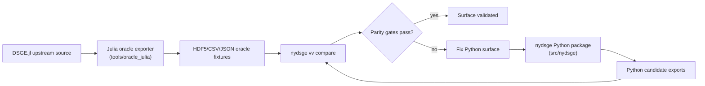
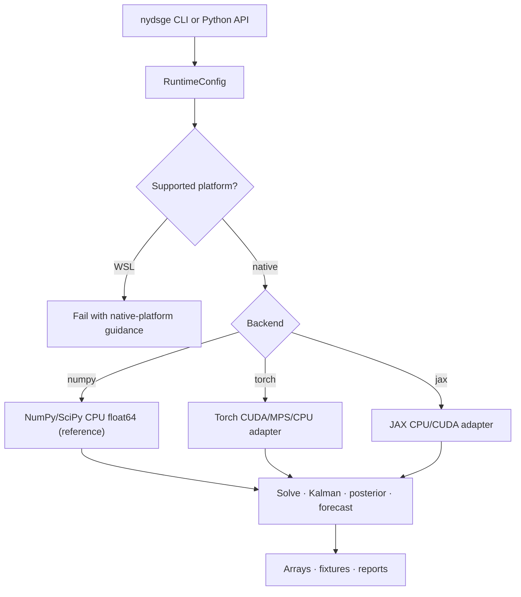
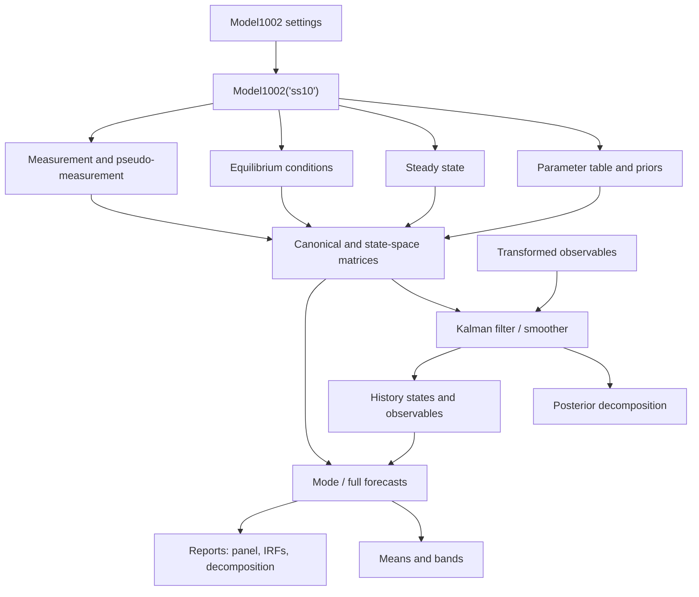
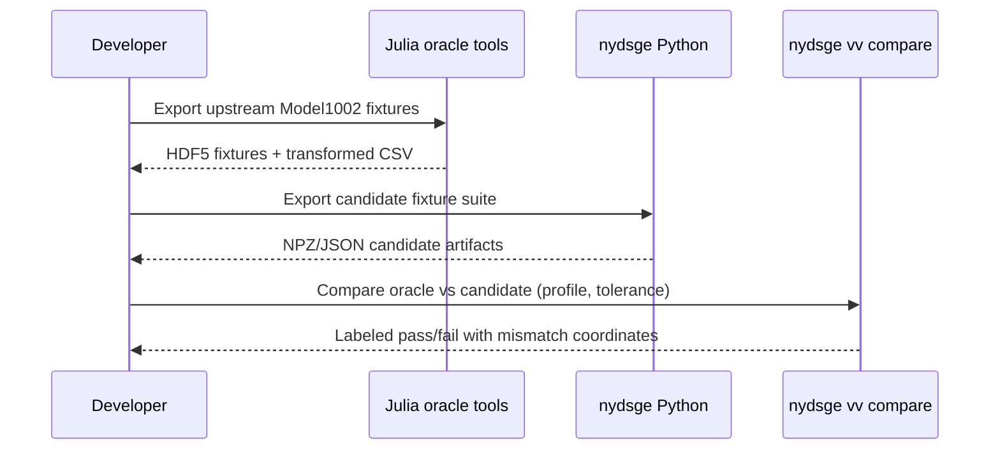

# nydsge

**A native Python port of the New York Fed DSGE model workflow — built for full
numerical parity with the upstream Julia implementation, with no Julia runtime
dependency.**

`nydsge` lets you construct, solve, estimate, forecast, validate, analyze, and
benchmark the New York Fed's `Model1002` entirely in Python. It reproduces the
behavior of [`FRBNY-DSGE/DSGE.jl`](https://github.com/FRBNY-DSGE/DSGE.jl) on a
NumPy/SciPy float64 CPU reference path, and every translated surface is checked
against Julia-generated oracle fixtures at strict tolerance.

The runtime package (`src/nydsge/`) is pure Python. Julia is used **only** during
development, under `tools/oracle_julia/`, to generate the parity fixtures — it is
never called to compute results. Once fixtures exist, the package runs with no
Julia installed.

---

## Why this exists

The NY Fed DSGE model is the reference implementation in the field, but it ties
the full workflow to a Julia toolchain. `nydsge` removes that dependency while
preserving results:

- **Same numbers, no Julia at runtime.** The CPU float64 path matches DSGE.jl to
  `atol = rtol = 1e-10` across setup, matrices, Kalman, posterior, forecasts, and
  means/bands.
- **Native Python ergonomics.** A `typer` CLI and a plain NumPy/pandas API, easy
  to embed in Python pipelines, notebooks, and CI.
- **Verifiable parity.** Every surface has a candidate export and a labeled oracle
  comparison profile, so "it matches" is a reproducible command, not a claim.
- **Optional acceleration.** Torch (CUDA/MPS) and JAX (CUDA) backends sit behind
  an explicit runtime layer; NumPy CPU remains the release-blocking reference.

## Current status

The first hard target — strict CPU float64 parity for `Model1002("ss10")` with
`data_vintage=181115` and `date_forecast_start=2018-Q4` — is validated at the
release horizon (40 quarters) and production draw count (1000 draws). All
numerical surfaces pass strict `1e-10`.

- Per-area parity status: [`docs/port_matrix.csv`](docs/port_matrix.csv)
- Release-grade fixture recipe and results:
  [`docs/release_fixture.md`](docs/release_fixture.md)

Accelerator captures (macOS MPS, Linux CUDA/JAX) are pending real-machine runs;
Windows CPU/CUDA baselines are captured.

---

## Installation

```powershell
uv sync                 # core package (NumPy/SciPy CPU reference path)
uv sync --extra plot    # + matplotlib for forecast report figures
uv sync --extra torch   # + Torch backend (use a CUDA/MPS wheel for acceleration)
uv sync --extra jax     # + JAX backend (CPU, or Linux CUDA)
```

`nydsge` requires Python ≥ 3.12. For Windows CUDA, install a Torch CUDA wheel
matching your toolkit before relying on `--backend torch --device cuda`.

Confirm the environment:

```powershell
uv run nydsge doctor --json      # platform, backend, device, dtype availability
uv run nydsge vv runtime-purity  # asserts no Julia/WSL/shell-out in the runtime
```

## Quickstart (CLI)

```powershell
# Discover models and solve the state-space system.
uv run nydsge models --json
uv run nydsge solve

# Forecast 40 quarters (modal path) and summarize with means/bands.
uv run nydsge forecast --horizon 40
uv run nydsge meansbands --input-type full --draws 1000 --seed 123 --horizon 40

# Produce a full forecast analysis report (panel + IRFs + decomposition).
uv run nydsge report forecast --data path\to\observables.csv --horizon 40 --output-dir outputs\forecast_report
```

## Quickstart (Python API)

```python
from nydsge.models import Model1002
from nydsge.runtime import RuntimeConfig
from nydsge.solve import compute_system
from nydsge.data import load_data
from nydsge.forecast import forecast_one, observable_irf, historical_decomposition

# Construct the hard-target model on the pure-Python CPU float64 reference path.
model = Model1002(
    subspec="ss10",
    runtime=RuntimeConfig(backend="numpy", device="cpu", dtype="float64"),
    settings={"data_vintage": "181115", "date_forecast_start": "2018-Q4"},
)

# Solve canonical -> gensys -> measurement into a state-space System.
system = compute_system(model)

# Load transformed observables (resolves the configured vintage CSV/FRED source).
data = load_data(model)

# Modal forecast with filtered/smoothed history.
forecast = forecast_one(
    model,
    input_type="mode",
    cond_type="none",
    output_vars=["histobs", "histstates", "forecastobs", "forecaststates"],
    horizon=40,
    data=data,
)

# Impulse responses and a true historical shock decomposition.
irf = observable_irf(system, horizon=40, normalization="one_sd")
decomposition = historical_decomposition(model, data=data)
```

Generate the analysis bundle programmatically:

```python
from nydsge.report import generate_forecast_report

artifacts = generate_forecast_report(
    model, output_dir="outputs/forecast_report", horizon=40, data=data
)
print(artifacts.summary)   # JSON manifest tying arrays and figures together
```

---

## How it works

The runtime is pure Python; the Julia side only produces fixtures used to prove
parity during development.



### Runtime control flow

A `RuntimeConfig` selects the backend, device, and dtype. NumPy CPU float64 is
the reference; Torch/JAX are optional accelerators. WSL is rejected in favor of
native platforms.



### Model1002 pipeline

Settings drive the parameter table, steady state, equilibrium conditions, and
measurement equations into the canonical and state-space matrices. Data flows
through the Kalman filter into the posterior, history, forecasts, and bands.



---

## Command reference

### Data

Build observables from raw levels, or assemble them from FRED/ALFRED sources.

```powershell
uv run nydsge data build --input path\to\raw_levels.csv --output path\to\observables.csv
uv run nydsge data sources --source-root path\to\raw --vintage 181115 --json
uv run nydsge data prepare-sources --source-root path\to\raw --vintage 181115 --start-date 1959-Q3 --end-date 2018-Q3 --json
uv run nydsge data fetch-fred-api --output path\to\raw\fred_181115.csv --realtime-start 181115 --realtime-end 181115 --start-date 1959-Q3 --end-date 2018-Q3
uv run nydsge data build-sources --source-root path\to\raw --output path\to\observables.csv --start-date 1959-Q3 --end-date 2018-Q3
```

- `data sources` lists source namespaces, required/optional mnemonics, candidate
  local paths, and availability under `--source-root`.
- `data fetch-fred-api` resolves the FRED key from `--api-key`, then
  `FRED_API_KEY`, then a local `.env`. Optional ALFRED-missing series are written
  as all-missing columns; required series must have a numeric value in every
  requested quarter.

### Estimation

```powershell
uv run nydsge estimate --data path\to\observables.csv
uv run nydsge estimate --data path\to\observables.csv --optimize --parameters alpha,rho --maxiter 25 --hessian --mode-output outputs\mode.npz
uv run nydsge estimate --data path\to\observables.csv --mode-input outputs\mode.npz --mh-draws 1000 --mh-burnin 100 --sampler-output outputs\sampler.npz
uv run nydsge vv sampler-diagnostics --sampler outputs\sampler.npz --windows 4 --json
```

`vv sampler-diagnostics` reports retained draws, acceptance windows, proposal
covariance health, log-posterior range, and per-parameter effective sample size.

### Forecasts

```powershell
uv run nydsge forecast --horizon 40
uv run nydsge forecast --input-type full --draws 1000 --seed 123 --horizon 40
uv run nydsge forecast --input-type full --sampler-draws outputs\sampler.npz --data path\to\observables.csv --include-history --horizon 40
uv run nydsge forecast --cond-type semi --data path\to\observables_with_condition.csv --include-history --horizon 40
uv run nydsge forecast --horizon 8 --zlb-rates "0.25,0.25,0.50,1.00" --json
```

### Means and bands

```powershell
uv run nydsge meansbands --horizon 40
uv run nydsge meansbands --input-type full --draws 1000 --seed 123 --horizon 40
uv run nydsge meansbands --cond-type full --source forecastobs --data path\to\observables_with_condition.csv
uv run nydsge meansbands --source forecastpseudo --horizon 40
```

### Forecast analysis reports

`nydsge report` produces forecast analysis artifacts: an all-observable macro
forecast panel, per-observable impulse responses, and a true historical shock
decomposition. Each command writes labeled numeric arrays (`.npz`), a JSON
summary, and — unless `--no-plots` is passed — deterministic PNG figures.
Plotting needs the `plot` extra; numeric arrays export without matplotlib.

```powershell
# Full bundle: macro panel + per-observable IRFs + historical decomposition.
uv run nydsge report forecast --data path\to\observables.csv --forecast-start 2018-Q4 --horizon 40 --output-dir outputs\forecast_report

# Impulse responses only (computed from the solved state-space system).
uv run nydsge report irf --horizon 40 --normalization one_sd --output-dir outputs\irf

# True historical shock decomposition (RTS-smoothed shock/state contributions).
uv run nydsge report historical-decomposition --data path\to\observables.csv --output-dir outputs\historical_decomposition

# Numeric arrays only, no figures.
uv run nydsge report irf --horizon 40 --no-plots --json
```

- IRF normalization is recorded in the summary: `unit` is a `1.0` impulse,
  `one_sd` a one-standard-deviation impulse (`sqrt(diag(QQ))`).
- The historical decomposition is genuine: per-shock contributions plus an
  initial-condition/deterministic baseline reconcile to the smoothed observable
  path (the command fails if reconciliation exceeds tolerance). It is **not** an
  IRF accumulation.
- Reports exit nonzero on inconsistent array dimensions or axis labels.

### AI and labor-market scenario study

`nydsge study ai-economy` downloads the current public FRED inputs, updates the
filtered/smoothed model state, performs a targeted MAP refresh of the demand,
marginal-efficiency-of-investment (MEI), and technology shock block, and saves a
reproducible scenario bundle.

```powershell
uv run nydsge study ai-economy `
  --model-end-date 2026-Q1 `
  --unemployment-targets "5,6,7,8,9,10,15" `
  --horizon 20 `
  --output-dir outputs\ai_economy_2026q2 `
  --json
```

The bundle includes current raw levels and transformed observables, the updated
shock-mode archive, baseline and conditional forecasts for every Model1002
observable, selected structural IRFs, conditional shock sequences, a compact
scenario summary, PNG figures, JSON metadata, and a Markdown technical report.

Model1002 does not observe unemployment directly. The unemployment scenarios
therefore use a documented historical bridge from quarterly changes in the
unemployment rate to log hours per capita, then solve for the minimum-norm shock
sequence consistent with the imposed labor path. These are conditional stress
paths, not identified causal estimates of AI. The command keeps unavailable
survey, Fernald TFP, and expected-rate inputs missing rather than silently using
non-equivalent proxies. The `ss10` structure is also not represented as the
private current NY Fed production parameterization; the exact upstream revision
checked is recorded in `study_metadata.json`.

### Quarterly economic package

`nydsge study economy` is the repeatable quarterly workflow. A versioned JSON
configuration defines the information cutoff, forecast horizon, exact fed-funds
rate paths, structural shock components, compound scenarios, unemployment stress
targets, and CPI input snapshots:

```powershell
uv run nydsge study economy `
  --config configs\quarterly_economy.json `
  --output-dir outputs\quarterly_economy_2026q3 `
  --json
```

Each run writes:

- baseline forecasts and 90% future-shock bands for every observable and
  pseudo-observable;
- exact policy-rate path ablations, structural scenarios, compound scenarios,
  and externally conditioned unemployment stresses;
- reconciled DSGE historical decompositions for all actuals, including grouped
  fiscal, monetary, inflation, GDP, and labor-productivity views;
- a separate reconciled BLS CPI decomposition for food, energy, core goods,
  shelter, other core services, and detailed subcomponents;
- source data, an updated targeted shock-mode archive when enabled, scenario
  shocks, data-quality metadata, PNG figures, and a Markdown economic report
  with dedicated small-multiple baseline panels for every observable and
  model-implied variable.

Open `quarterly_economic_report.md` as the reader entrypoint. The complete
machine-readable projection rundown is retained alongside it in
`baseline_forecast_all_variables.csv`,
`scenario_forecast_all_variables.csv`, `scenario_summary.csv`,
`historical_decomposition_grouped.csv`, and `run_metadata.json`.

To roll the package forward, copy the configuration, change
`model_end_date`, replace the three versioned `data/cpi/bls_table7_*.csv`
snapshots with the latest quarter-end BLS Table 7 values, and run the command.
Set `fred_levels_path` to a frozen local vintage for exact replay or leave it
`null` to fetch the current public FRED panel. The run fails on date-grid
defects, stale CPI snapshots, duplicate scenario names, unknown shocks, or
decomposition reconciliation failures.

The package keeps causal concepts separate. The DSGE `g_sh` is a
government-spending shock, not an identified tax/transfer shock;
`corepce_sh` is a measurement innovation, not a structural supply shock; BLS
CPI bars are statistical basket contributions; and unemployment is imposed
through a documented external hours bridge because it is not a Model1002
observable.

---

## Validation and parity

Parity is reproducible: export a candidate bundle, then compare it against the
Julia oracle directory under a named profile and tolerance.



```powershell
# Export the Python candidate bundle and compare the combined hard target.
uv run nydsge vv export-suite --output-dir tests/fixtures/candidate --data path\to\observables.csv --full-draws 1000 --seed 123 --horizon 40 --json
uv run nydsge vv compare --oracle-dir tests/fixtures/oracle --candidate-dir tests/fixtures/candidate --profile hard-target --tolerance-profile strict --json

# Isolate one surface when debugging.
uv run nydsge vv compare --profile matrix --tolerance-profile strict --json
uv run nydsge vv compare --profile kalman --tolerance-profile strict --json
uv run nydsge vv compare --profile posterior --tolerance-profile strict --json
uv run nydsge vv compare --profile forecast-full --tolerance-profile strict --json
```

Surface profiles: `model-setup`, `model-metadata`, `matrix`,
`financial-frictions`, `kalman`, `posterior`, `forecast-mode`,
`forecast-mode-history`, `forecast-full`, `forecast-full-history`, and the
combined `hard-target`.

Named tolerance profiles keep comparisons explicit:

| Profile | Tolerance | Used for |
|---|---|---|
| `strict` / `cpu-oracle` | `atol = rtol = 1e-10` | CPU oracle, matrices, hard target |
| `forecast` | `atol = rtol = 1e-8` | forecast / means-bands accumulation |
| `accelerator` | `atol = rtol = 1e-5` | Torch / JAX vs NumPy CPU |

See [`docs/translation_validation_2026q2.md`](docs/translation_validation_2026q2.md)
for the latest pinned-Julia, current-data audit, numeric differences, scenario
checks, and explicit certification boundaries.

Backend parity and benchmarks:

```powershell
uv run nydsge vv backend-parity --kernel all --horizon 40 --periods 40 --tolerance-profile accelerator --json
uv run nydsge bench --kernel all --horizon 40 --periods 40 --batches 8 --draws 2 --repeats 3 --output reports\benchmarks\local.json
```

See [`docs/benchmark_references.md`](docs/benchmark_references.md) for the
cross-machine capture workflow and `scripts/capture_benchmarks.py` /
`scripts/compare_benchmark_reports.py` for bundling and comparing reports.

---

## Repository layout

```text
src/nydsge/
  backends.py     Runtime array adapters (NumPy / Torch / JAX).
  bench.py        Benchmark kernels and reporting.
  cli.py          Typer command surface (data, estimate, forecast, vv, report, bench).
  core.py         Model, setting, parameter, and transform types.
  data.py         Data loading, transforms, and FRED/ALFRED source builders.
  economy.py      Repeatable quarterly baseline, scenarios, and decompositions.
  estimate.py     Posterior evaluation, optimization, MH sampling.
  forecast.py     Forecasts, means/bands, IRF, historical decomposition.
  kalman.py       Filtering, smoothing, and likelihood kernels.
  report.py       Forecast analysis reports (arrays + figures).
  scenarios.py    Current-data AI, unemployment, and structural-shock studies.
  runtime.py      Platform, backend, device, and dtype selection.
  solve.py        Gensys and state-space solve helpers.
  vv.py           Fixture export, coverage, and comparison tools.
  models/         Model registry and Model1002 translation surfaces.

tools/oracle_julia/   Migration-only Julia fixture/benchmark exporters.
docs/                 Port matrix, release fixture recipe, benchmark references.
tests/                Unit, CLI, and parity tests; generated fixtures (ignored).
```

## Platform support

- **macOS** — CPU, Torch MPS (float32 accelerator; float64 uses CPU parity).
- **Windows** — CPU, Torch CUDA.
- **Linux** — CPU, Torch CUDA, JAX CUDA.
- **WSL is intentionally unsupported.** `nydsge doctor` exits nonzero on WSL and
  points to native Windows, macOS, or Linux.

NumPy/SciPy float64 CPU is always the release-blocking reference path.

## Julia oracle tools (development only)

The Julia tooling generates parity fixtures and is never part of the runtime.

```powershell
juliaup add 1.8
julia +1.8 tools/oracle_julia/setup_env.jl
julia +1.8 --project=tools/oracle_julia tools/oracle_julia/export_model1002.jl --out tests/fixtures/oracle/m1002_ss10.h5
```

Real-vintage hard-target replay (Julia exports the vintage + shocks, Python
replays and compares):

```powershell
julia +1.8 --project=tools/oracle_julia tools/oracle_julia/export_model1002.jl --out tests/fixtures/oracle/m1002_ss10_real_history.h5 --include-history true --include-kalman true --include-posterior true --include-forecast true --include-full-forecast true --full-draws 2 --data-out tests/fixtures/oracle/observables.csv --horizon 2
uv run nydsge vv export-suite --output-dir tests/fixtures/candidate --data tests/fixtures/oracle/observables.csv --shock-samples tests/fixtures/oracle/m1002_ss10_real_history.h5 --allow-empty-data-columns --horizon 2 --json
uv run nydsge vv compare --oracle-dir tests/fixtures/oracle --candidate-dir tests/fixtures/candidate --profile hard-target --tolerance-profile strict --json
```

The full release-grade recipe (horizon 40, 1000 draws) is in
[`docs/release_fixture.md`](docs/release_fixture.md).

## Development

```powershell
uv sync
uv run ruff format --check .
uv run ruff check .
uv run ty check .
uv run pytest
```

## References

- [DSGE.jl](https://github.com/FRBNY-DSGE/DSGE.jl) ·
  [docs](https://frbny-dsge.github.io/DSGE.jl/latest/)
- [PyTorch install](https://pytorch.org/get-started/locally/) ·
  [MPS notes](https://docs.pytorch.org/docs/stable/notes/mps.html)
- [JAX install](https://docs.jax.dev/en/latest/installation.html)
